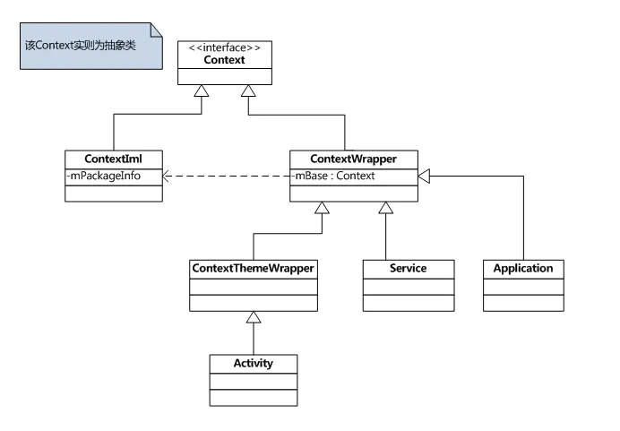

#### [Context详解](https://www.jianshu.com/p/46c35c5079b4)

继承关系：

Context：顶层接口，Context的直接实现子类有ContextImpl和ContextWapper

ContextImpl：实现类，实现Context中具体功能

ContextWapper：包装类，子类有ContextThemeWapper，Application，Service

ContextThemeWapper：包装类，内部含有Theme的实现，子类有Activity

1. Context的区别
   1. Application，Service和ContextThemeWapper同级，ContextThemeWapper中实现了Theme相关功能，Activity等UI需要用到Theme功能，所以只有Activity的Context才可以做创建Dialog等UI相关操作，同时在Application和Service中启动Activity需要指定新的Task
2. ContextImpl与其他ContextWapper关联的地方：
   1. Application：每个应用创建的时候，在AMS告诉ActivityThread创建Activity时，handleBindAppliaction->makeApplication->，初始化ContextImpl，->Instrumentation.newApplcation->关联ContextImpl
   2. Service：通过startService或者bindService时，如果系统检测需要创建一个Service时，都会调用ActivityThread的handleCreateService方法，初始化Service，完成ContextImpl的关联
   3. Activity：创建一个新的Activity时，handleLaunchActivity->performLaunchActivity->createBaseContextForActivity->关联ContextImpl
