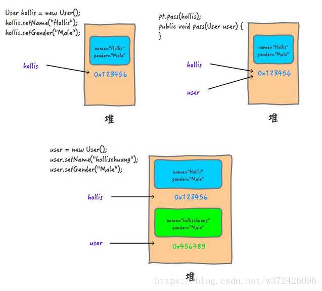
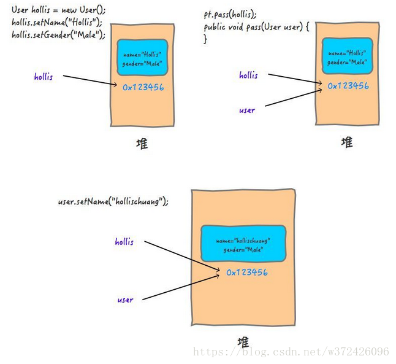

#### Java对象与引用 [(1)](https://blog.csdn.net/qq_41854911/article/details/122149948)

##### 理解

```java
Vehicle v1 = new Vehicle();
Vehicle v2 = v1;
```

> Vehicle v1：声明一个引用
>
> new Vehicle()：创建一个对象
>
> = ：把对象的内存地址赋值给引用

相当于：v1引用的值是Vehicle实例对象的内存地址

> Vehicle v2：声明一个引用
>
> v2 = v1：把v1的值赋值给引用v2，v1的值是Vehicle实例对象的地址，因此v2引用的值也是同一个实例对象的地址，所以对v1或者v2的修改，都会修改到同一个内存地址中的对象实例，从而影响到对此内存地址的引用

##### Java中的参数传递只有值传递，没有引用传递

值传递：会创建实参副本，函数中无法改变原始对象

引用传递：不会创建实参副本，函数中会改变原始对象

*如何解释java传递对象实参时会，在函数中修改形参会改变实参对象的值？

> java中传参是以值传递，那么如果实参是对象的引用，则传递的值则是引用的值，引用的值则是对象的地址，所以在函数中的形参对象和传入的实参对象引用地址相同，如果直接修改此形参，则会影响所有持有该对象内存地址的引用；说到底，Java中对于对象实参，传递的内容是对象的引用——对象内存地址

e1，由于在pass方法中，user被赋值了新的对象，会重新开辟一块内存赋值给user，区别与原对象的内存地址，因此不会影响原对象的引用:

```java
public static void main(String[] args) {
    ParamTest pt = new ParamTest();
 
    User hollis = new User();
    hollis.setName("Hollis");
    hollis.setGender("Male");
    pt.pass(hollis);
    System.out.println("print in main , user is " + hollis);
}
 
public void pass(User user) {
    user = new User();
    user.setName("hollischuang");
    user.setGender("Male");
    System.out.println("print in pass , user is " + user);
}
```



e2，此时修改的是形参的值，即实参的值——引用的对象——形参持有的地址中的存储内容，会影响该对象的所有引用：

```java
public static void main(String[] args) {
    ParamTest pt = new ParamTest();
 
    User hollis = new User();
    hollis.setName("Hollis");
    hollis.setGender("Male");
    pt.pass(hollis);
    System.out.println("print in main , user is " + hollis);
}
 
public void pass(User user) {
    user.setName("hollischuang");
    System.out.println("print in pass , user is " + user);
}
```



##### Java中引用的种类

强引用：只要对象还保持有强引用，则GC永远永远不会回收这个被引用的对象

软引用：在系统内存不够时，GC才会回收弱引用关联的对象

弱引用：只能存活于GC到来之前的

虚引用：用于标记GC回收的时刻

#### Java内存模型 [(1)](https://www.likecs.com/show-833565.html#sc=2200)

1. 堆
   1. 线程共享，存储对象实例，Java GC管理的主要区域
   2. 存放新生代和老年代对象
   3. 内存逻辑连续，物理不不连续，可扩展
2. 方法区
   1. 线程共享，存储已经被虚拟机加载的类信息，final常量，静态变量，编译器生成的代码等
   2. 存放永久代对象
   3. 内存逻辑连续，物理不不连续，可扩展
3. java虚拟机栈
   1. 线程私有，每一个线程都对应一个JVM虚拟机栈，内部管理方法执行时生成的栈帧
   2. 当线程中的方法执行的时，都会生成一个栈帧，栈帧中保存了方法的局部变量表，操作站，动态链接，方法出口等；当方法被调用时，方法的栈帧在JVM虚拟机中入栈，当方法执行完毕后，栈帧出栈
   3. 方法运行时所需要分配的空间是完全确定的，在方法的生命周期内不会改变
   4. StatckOverFlowError和OutOfMemoryError在此定义
4. 本地方法栈
   1. 线程私有
   2. 作用和java虚拟机栈类似，内部执行的是本地方法（native方法）
5. 程序计数器
   1. 线程私有，只记录当前线程执行的虚拟机字节码指令地址，字节码解释器在工作时会改变这个值，获取下一条语句指令
   2. 如果执行的是Java方法，记录虚拟机字节码指令地址；如果执行的是本地方法，计数器的值则为unDefined

#### 内存回收机制

##### 垃圾回收方法：

###### 引用器计数法

每个对象都有一个引用计数器，当对象被创建并且赋值后，计数器值变为1，每当一个地方引用他计数器就加1，反之减1，引用计数器为0时则表示当前对象可以被GC回收，执行简单高效，但是不适合复杂的、存在循环关系的引用，且对计数器的操作会增加程序的开销

###### 根搜索算法

根集：正在执行的Java程序可以访问的引用变量集合，包括局部变量，参数，类变量等

以一系列根对象集合为起点，搜索对应的引用节点，再通过这些节点搜索他们的引用节点，搜索引用节点的路径称为引用链，搜索的结果是内存中存活的对象都会被根节点对象集合直接或间接引用，如果一个目标对象不可达（没有引用链存在），则说明该对象需要被回收

不可达的对象不会被立即回收，而是至少需要经过两次标记过程后，仍然不可达的对象则会被回收；第一次搜索标记，判断是否有必要执行finalize方法，对于有必要执行此方法的对象将被放入到F-Queue队列中；第二次搜索标记中，如果被搜索的对象与根节点集合有引用关系，则会被移除F-Queue队列，否则则会被回收

###### 复制算法

复制算法采用是从根集合中扫描出存活的对象，并将找到的存活对象复制到一块全新的使用空间中，因此需要一块空的内存空间存放被复制的存活对象，当内存中对象比较少的时候复制算法比较高效，但是需要额外的空内存区域，以及需要对存活对象进行移动

###### 标记-清除

从根集合中扫描出存活的对象进行标记，标记完成后再扫描出内存中未被标记的对象，并进行清除，且不对存活对象进行移动

在标记阶段需要对所有内存对象进行扫描，因此比较耗时

在清除阶段回收没有引用的对象，存活的对象被保留，内存分配器会持有空闲空间的引用列表，当被请求分配内存时会查询此列表进行分配，因此会产生内存碎片

###### 标记压缩

从根集合中扫描出存活的对象进行标记，标记完成后再扫描出内存中未被标记的对象，进行清除，清除完成后把存活的对象向空闲内存一端移动，更新其引用对象的指针

清除完成后对内存进行规整，解决了内存碎片的问题，但是需要对存活对象进行移动

###### 分代回收

三种GC：Minor GC，Major GC，Full GC

Minor GC：当新生代中Eden区内存不够时就会触发

Major GC：当老年代中内存不足时，会尝试触发Minor GC，如果之后内存空间还不够时，则会触发Major GC

Full GC：调用System.gc()；老年代空间不足；方法区空间不足；Minor GC后，新生代的对象转存到老年代中时；

分代回收把内存分为：

1. 新生代：包括Eden区和Survivor区，占比大概8:2，用来存放新生成的对象；一般使用复制回收算法，使用Minor GC
2. 老年代：存放多次GC后仍然存活的对象（默认15次）；一般使用标记压缩算法回收，使用Major GC和Full GC
3. 永久代：存放静态文件，java类，方法等，永久代的回收对象主要是弃用的常量和无用的类

回收算法：

1. 大多数新创建的对象都会被分配到Eden区中，当Eden区内存被占满后，则会触发GC，GC后Eden区存活下来的对象则会被放在Survivor区中
2. Survivor区分为两个，S0和S1，存放每次GC存活下来的对象且始终会保持一个Survivor区中是空的；GC检查时也会检查存放对象的Survivor区，并且同Eden区中对象一起放入为空的Survivor区中，经过多次GC后仍然存活的对象会被放入到老年代中
3. 所有生代中的无栈区引用的对象也终将被回收

##### CG触发的条件

1. 程序空闲
2. 内存存满
